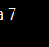
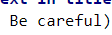

# Work with Git

## 1. Check to downloaded Git.
In terminal do command `git version`.
If Git downloaded - appear message about version of program.
Else appear message about error.

## 2. Installation Git.
Load last version Git on site https://git-scm.com/downloads. Install with default settings.

## 3. Setting Git.
On first using Git need to welcome. For it need in terminal 2 commands:
```
$ git config --global user.name "name"
$ git config --global user.email "email@example.com"
```
## 4. Initialize repositorium.
For initialize repositorium use command `git init`.
## 5. Record changes in repo.
If u want to see changes added to commit and branch, where u located - use command `git status`.  
If u want to add information in next saved commit - use command `git add`.  
If u want to save changes commit in branch - use command `git commit`.  
If u want to see difference between unsaved (current) and save (previous) commit - use command `git diff`.
## 6. View commits of history.
For view saved commits in branch - type command `git log`.
## 7. The moving between saving.
If u need to moved on other version Git in repo of file - use to command `git checkout`.  
*for moved in main commit - use command `git checkout master` (if you named main brannch **master**. Else use other name)

## 8. Ignoring of files.

For exept on tracking of repo files and folders - u need create file *.gitignore* and record in him names, that files.

## 9. Create branches in Git.

In result - vector on commit
Branch Git - easy transporting on 1 from commits, usually last in commits line.  
By default name branch - __master__.

Create branch may command:
```
git branch <name new branch>
```
Add list of branch with help command:
```
git branch
```
Current branch was mark "*": **\*master**

## 10. Merged branches
*git merge*

In situation on conflict - choose your answer in file.  


## 11. Ignoring files

For ignoring files formats png, bmp, tmp, etc, use next rules:
1. create empty file with name **".gitignore"**
2. add information in file (what if type of files git must be ignoring throughout changes repo - example - **"*.png"** - all files with type PNG. Or certain file - **"name_file.png"**)
3. saved you changes in current branch

## 12. Other information

For create new branch - use command "git branch "namebranch" (without "). Create and switched on branch u help command "git checkout -b "namebranch"

For merged 2 branches - use command "**git merge "name_branch**" (Attention!!! For merge branch, for example, __"master"__ with __"other"__ branch - u need to contain in branch __"master"__.)

For delay conflicts on merging 2 branches interface VS help u choose correct variant. After u can save your changes, using command __"git commit -am "text in title""__ - its command saved changes in __ALL__ files in your repo. Be careful)

And, finally, delete branch u can with command __"git branch -d "name_branch""__ (d - delete. D - deep clean from cash. )

# ***Good luck!***

Upd (10.12.2022):

# Work with remote repo

## How to push local repo in GitHun

1. Create account on GitHub
2. Create local repo
3. "Friend" local and "Deleted repo"/ GitHub on creating new repo help u with it.
4. Send (*git push*) your local repo in GitHub. Maybe, u need to register on delete repo.
5. Go back on other PC.
6. For load on remote repo in local (on PC) - load (command *git pull*) actual condition on other repo.

## How to add pull request on repo, how we "Forked" on GitHub

1. "Forked" file u need open in your account on GitHub (next GH)
2. Copy to link on repo - press "Code" and copy
3. In local repo after "pulling" and "redacting", u need to send command **git push -u <name repo> <link on GH>**
Warning! Just using command **git push** can do not "send" changes on GH. Use command up.
* **"-u"** mean - **--set-upstream**
Someone words on "pulling" repo fron GH - good rule on redicting repo - do changes on other branch. So, saved files in your local repo u need to do onnew branch. (Course, u need to placement on her.) 

***on autor - sorry, mb this description someone confusing and no comfortable)))**

4. Go to GH and knocked **Compare & pull request**

### Good job.
